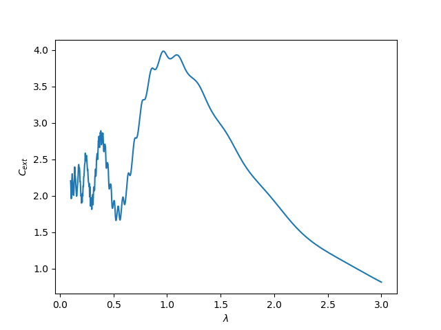

# ScatterMeta
> Analysis and Calculation of 2D/3D scatters

## Features
1. Finite-difference frequency-domain method [1,2]
2. Discrete Dipole Approximation (DDA) [3]
3. Mie Scattering for the particle with spherical symmetry

## References
[1]Simple Implementation of Arbitrarily Shaped Total-Field/Scattered-Field Regions in Finite-Difference Frequency-Domain [link](http://www.jpier.org/PIERB/pierb36/11.11092006.pdf)

[2]EM Lab Poster on FDFD [link]()

[3]Evlyukhin, Andrey B., Carsten Reinhardt, and Boris N. Chichkov. "Multipole light scattering by nonspherical nanoparticles in the discrete dipole approximation." Physical Review B 84.23 (2011): 235429.